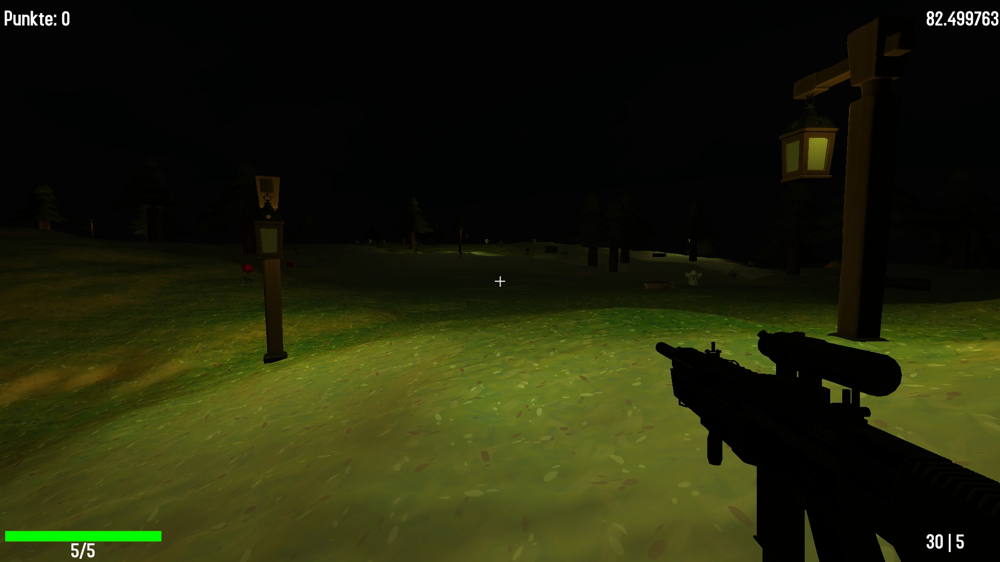

Computergrafik Projekt SS22, Thema: First Person Shooter

Projektteilnehmer:

Patrick Felschen, 932056
Julian Voß, 934505

***************************************************************************
Um das Spiel zu starten kann die folgende EXE gestartet werden:

- \bin\game\CG-Spiel.exe

***************************************************************************
Anleitung:

Nach dem Start des Spiels befindet sich der Spieler in der Mitte eines Waldes. Um den Spieler herum erscheinen Geister, 
welche sich auf den Spieler zubewegen. Schafft der Spieler es nicht die Geister zu erschießen,
bevor sie ihn erreicht haben, erhält der Spieler Schaden. Für jeden erschossenen Geist gibt es einen Punkt.
Munition und Leben können über Kisten aufgefüllt werden, die sich im Umfeld befinden. Je mehr Punkte erreicht werden,
desto schwieriger wird das Spiel. Die Geister werden schneller und erhalten mehr Lebenspunkte. Stirbt der Spieler,
wird der Punktestand beim Erreichen eines neuen Highscores abgespeichert. Anschließend kann
das Spiel neu gestartet werden.

***************************************************************************
Steuerung:

- W-Taste: Bewegung vorwärts
- S-Taste: Bewegung rückwärts
- A-Taste: Bewegung nach links
- D-Taste: Bewegung nach rechts
- R-Taste: Nachladen
- Shift-Taste (links): Sprint
- Linke Maustaste: Schießen
- Mausbewegung: Ausrichtung der First-Person-Kamera

***************************************************************************
Ordnerstruktur:

- \bin\game : Ausführbares Spiel, notwendige Bibliotheken
- \project\assets : GUI-Schriftart, 3D-OBJ-Dateien, Shader Codes, Sounds, Hightmap
- \project\libraries : assimp, freeimage, glew, glfw, imgui, irrklang
- \project\src : C++ Source Dateien

***************************************************************************
Quellen:

Genaue Quellenangaben sind als Kommentare im Quellcode zu finden.

Hauptsächliche Quellen:

- Learn OpenGL - https://learnopengl.com/
- OGLDEV - https://ogldev.org/
- 3D Modelle - https://rigmodels.com/
- ThinMatrix - https://www.youtube.com/watch?v=VS8wlS9hF8E&list=PLRIWtICgwaX0u7Rf9zkZhLoLuZVfUksDP
- The Cherno - https://www.youtube.com/watch?v=W3gAzLwfIP0&list=PLlrATfBNZ98foTJPJ_Ev03o2oq3-GGOS2

***************************************************************************
Hinweise:

Das Projekt wurde mit der Entwicklungsumgebung CLion umgesetzt. Über die 
CMakeLists.txt lässt sich das Projekt auch in Visual Studio 
als CMake Projekt öffnen. (File -> Open -> CMake…)
